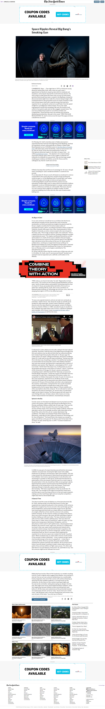

# NEW YORK TIMES HOMEPAGE

> Very Handy Project To Improve Your Web Design Capacity.

Additional description about the project and its features.

## Built With

- HTML
- CSS

## Live Demo

[Live Demo Link](https://murodjon000.github.io/times-page/)

## Getting Started

**If you want to make imporvement to this project i will be happy😀😉**
**You can clone it to your computer in order to make improvment**

To get the local copy up and running follow these simple example steps.

On your terminal:

- Clone the repository with `https://github.com/Murodjon000/times-page.git` to get a local copy.
- cd into the folder where the project is stored in your machine.
- To look at the code on the editor, for vscode type: _`code . `_
- To view the project on your browser, if you are working with vscode, on the status bar, click on `Go Live`,
  alternatively, inside the project folder, on your machine, look for a html file, right-click on it and
  select the browser of your choice, to view the project.

👤 **Author**

- GitHub: [@Murodjon000](https://github.com/Murodjon000)
- LinkedIn: [murodjon-tursunpulatov](https://www.linkedin.com/in/murodjon-tursunpulatov-5189481b3/)

## 🤝 Contributing

Contributions, issues, and feature requests are welcome!

Feel free to check the [issues page](https://github.com/Murodjon000/times-page/issues).

## Show your support

Give a ⭐️ if you like this project!

## Acknowledgments

- Hat tip to anyone whose code was used
- Inspiration
- etc

## 📝 License

Copyright 2020 Murodjon Tursunpulatov

Permission is hereby granted, free of charge, to any person obtaining a copy of this software and associated documentation files (the "Software"), to deal in the Software without restriction, including without limitation the rights to use, copy, modify, merge, publish, distribute, sublicense, and/or sell copies of the Software, and to permit persons to whom the Software is furnished to do so, subject to the following conditions:

The above copyright notice and this permission notice shall be included in all copies or substantial portions of the Software.

THE SOFTWARE IS PROVIDED "AS IS", WITHOUT WARRANTY OF ANY KIND, EXPRESS OR IMPLIED, INCLUDING BUT NOT LIMITED TO THE WARRANTIES OF MERCHANTABILITY, FITNESS FOR A PARTICULAR PURPOSE AND NONINFRINGEMENT. IN NO EVENT SHALL THE AUTHORS OR COPYRIGHT HOLDERS BE LIABLE FOR ANY CLAIM, DAMAGES OR OTHER LIABILITY, WHETHER IN AN ACTION OF CONTRACT, TORT OR OTHERWISE, ARISING FROM, OUT OF OR IN CONNECTION WITH THE SOFTWARE OR THE USE OR OTHER DEALINGS IN THE SOFTWARE.
